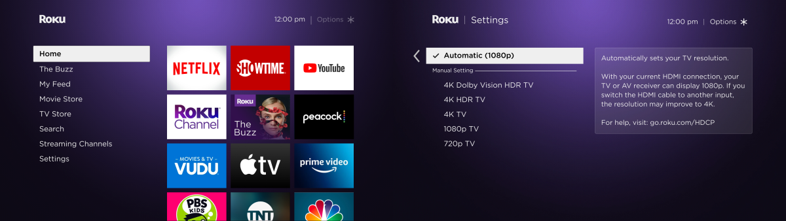
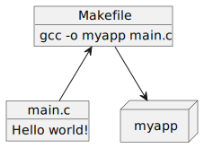

This is the author's personal copy of the January 2023 Roku Engineering Blog Post, [You Need a Build System](https://engineering.roku.com/you-need-a-build-system). Please read it there!

 

 

  

# You Need a Build System

**RokuOS** is our single operating system that runs on all of our streaming players, smart TVs, and soundbars. It is a highly customized user experience built on top of an embedded Linux kernel that runs "channels" such as _Netflix_, _Prime Video_, and _The Roku Channel_, which are displayed on a grid on our iconic Roku home screen.

Today's article focuses on the system we use to build RokuOS.  The question is:  How do we translate the source code for all of RokuOS's components to something that can run on every unique device?  "A compiler, of course!" you say.  Easy answer!  But it's a bit more complicated: **You need a _build system_**

Since RokuOS runs on a wide variety of hardware devices, it is able to control various aspects of each. For example, it knows how to talk to a platform's specific HDMI controller to change the HDMI output resolution.  Our software stack, therefore, has many libraries which abstract the ways user-facing applications control physical hardware.  So while the user experience will be the same regardless which Roku device you use, the underlying software can have vast differences due to changes in the physical hardware and available features!

## Defining a "Build System"

When we say _build system_, what do we actually mean? _GNU Make_ is a build system, but so is _Bazel_ and _Buildroot_, and these are all very different applications.

Let's simplify this by sorting different kinds of build systems into three distinct classes:

1. **GCBS**: Generic Component Build Systems
2. **MBS**: Meta Build Systems
3. **EXBS**: Exotic/Specialty Build Systems

Let's look at each in turn.

### 1. Generic Component Build Systems

A Generic Component Build System (GCBS) is what people most commonly think of when you say "build system." This class includes applications like _GNU Make_, _Autotools_ (incl. _Automake_, _Libtool_), _CMake_, _Ninja_, _Gradle_, _Bazel_, etc.

GCBSs are very flexible in what they can do -- they're not specifically tailored towards one specific goal. They are essentially a scripting language for build commands. You can do pretty much anything you want with them, including taking _Make_ and creating a massive toolchain-compiling, cross-compiling-focused, embedded-rootfs-and-image-creating system. _Buildroot_, a MBS, does this. However just because you can do something and it will work, it doesn't mean you should.

GCBSs have their place and purpose, and some GCBSs do things better than others. _Make_ is universal: The _Autotools_ suite and _CMake_ are similar in that they generate Makefiles -- their whole purpose is to relieve developers from the work of hand-crafting Makefiles by using translation language. _Gradle_ is more geared towards Java and Android applications and can automate or make some things easier for developers using those technologies.  They all do different things but solve the same goal:  to make compiling your code easier.

Overall, if you are working with a single component, it will most likely use a GCBS class build system.

### 2. Meta Build Systems

A Meta Build System (MBS) is purpose-built to accomplish two primary goals:

1. Compile multiple linked codebases, a.k.a. "components" (also called packages, recipes, or elements)
2. From compiled packages, assemble a Root Linux Filesystem, or "RootFS"

Within a MBS, each "component" has its own individual codebase with its own GCBS.  The MBS doesn't invoke compiler commands directly, but indirectly by talking to that component's GCBS instead.  For example the MBS _Buildroot_ might include a component called _Busybox_ which uses GCBS _Make_, and _Make_ will run the compiler.

MBSs can also offer features that are geared toward Embedded Linux development, such as cross-compiling, compiling the Linux kernel, and generating flashable images for use in embedded bootloaders like _U-Boot_ (which also might be compiled at the same time). _Buildroot_ and _OpenEmbedded/Yocto_ are examples of MBSs that do cross-compiling for Embedded Linux in this manner.

GCBSs can be made to do what MBSs are designed to do, but they aren't specifically designed for this purpose. It's normally better to choose an MBS than to force-fit a GCBS.

### 3. Exotic/Specialty Build Systems

Exotic/Specialty Build Systems, or EXBSs, are typically custom-made and tailored towards specific use-cases for their applications/platforms.

An example of an EXBS is the _Arch Build System_, which contains many different pieces to help build the _Arch Linux_ distribution.  It works like this: _Pacman_ the package manager uses packages ("components") from their official package repos and the _Arch User Repository_. Packages are built from source by _Makepkg_, where the packages use their _PKGBUILD_ system to define source and how-to-build. _Arch Linux_ "releases" are created by using _Archiso_, which essentially uses a defined set of packages and uses _Pacman_ to download pre-made packages from their package repos and install them in a packaged RootFS.

We classify the _Arch Build System_ as an EXBS rather than an MBS because it is not a single application that compiles and packages multiple codebases at one time, then uses those packages to build a RootFS. It's an EXBS because it compiles and packages at multiple stages under very different timing.

Most popular Linux distributions use some type of EXBS, and their systems are rarely usable beyond their intended scope unless significant development effort is made to "fork" and modify the system for another distribution (which actually makes it a different EXBS).

## Picking Your Build System Contenders

So why are we talking about this?  Recently, to meet the scaling challenges of the growing number of Roku TVs and players, we ran an internal review to evaluate whether to migrate RokuOS onto a new build system.

For our use cases, we clearly want to pick a **Meta Build System** since this type is meant for cross-compiling embedded environments. We wouldn't, for example, want to choose a GCBS like _CMake_, then have to implement a lot of features which come standard in a MBS.

What options do we have when picking a Meta Build System? There are actually only four:

1. _BitBake/OpenEmbedded_ from the _Yocto_ project.
2. _Buildroot_
3. _OpenWrt's Buildroot_, which is distinctly different.
4. _BuildStream_

Not all MBSs are created equal. Since we are actively developing RokuOS and need to test the build results on real devices, the MBS needs to be fast and efficient when iteratively building code changes. This situation is called _Active Development_, and contrary to what you may think, MBSs are not particularly very good at it! Instead, the primary users of MBSs are system integrators, not software developers. MBSs were designed to manipulate software components that are already released and known to be working, combining them into a full operating system. 

Some tests to determine friendliness to _Active Development_ are: If you make a code change in one file of one component, how well can the build system handle that change in a global scope? Can it only rebuild that area? Is the time it takes to do so proportional to the amount of code changed, or does it need to perform all sorts of other tasks too? What about dependencies and dependent (and dependent of dependent) components? What about changing how the build tool is building the source -- is that easy to do, or does the developer need to open a hundred-page document to figure it out?

We needed to pick a MBS that was the least hostile to _Active Development_, and _Buildroot_ was the first to be eliminated. Its primary use-case is strictly for system integrators. It downloads items during build-time without developer-focused tools to allow dynamically-updating component source code. _OpenWrt's Buildroot_, which is an evolved fork of _Buildroot_, fares a bit better here via their more modular Packages system, however it still has the same issue.

Well, there goes 50% of the choices already! The remaining two were selected for our evaluation:

* _BitBake/OpenEmbedded_, part of the _Yocto_ project, was quickly chosen as a contender given it is the de facto standard build system for the embedded Linux industry. It might not the best for _Active Development_, but it is by far the best-supported build system out there, and many of our vendors already have BitBake meta layers available. [Check them out at yoctoproject.org](https://www.yoctoproject.org/)
* _BuildStream_. Who's this? You may not have heard about this system before -- we certainly hadn't. However, the introduction on their website was quite promising, and the system appeared to accomplish the same goals as _BitBake_ while being easier to use and friendlier to _Active Development_. We selected _BuildStream_ as the only other contender. [Check them out at buildstream.build](https://buildstream.build/)

## A Spicy Competition

In our Meta Build Evaluation group, we split into two teams -- _BitBake_ and _BuildStream_. Each team had the goal of creating something that could evolve to eventually support the full RokuOS:

* Create a Linux distribution using no pre-built binaries, with platform-level exceptions
* Run it on that build system's first new "Roku device:" a _Raspberry Pi_
* The build system must create a GCC 12 cross-compiler from scratch
* Cross-compile our "base layer" of _Busybox_, _Boost_, _Flatbuffers_, and [_rostd_](https://github.com/rokudev/rostd)
* Build a platform-selectable Linux kernel
* Cross-compile our "platform layer" with platform-selectable items. For the RPi, that would be the Broadcom binaries.
* Have a separate, user-selectable "debug layer" with _GDBServer_ and _Dropbear_
* Finally, build the final flashable image, which is also platform-selectable. For the RPi, that would be an SD card image.

In evaluating, the teams paid attention to various developer-focused preferences, such as the ease of editing source code and build recipes, how well build accelerators like caching and distributed builds work, and their overall sentiment towards their build system.

After a few weeks, both teams were able to successfully accomplish the evaluation goals!

### The BitBake Evaluation

The BitBake team's evaluation was relatively straightforward, considering that the [_OpenEmbedded_](http://www.openembedded.org/wiki/Main_Page) project and many other meta layers already provide recipes for all of the above tasks! It was only a matter of putting it all together.

### The BuildStream Evaluation

The BuildStream team's evaluation had a bit more work since it doesn't really have an equivalent _OpenEmbedded_ project. The closest existing BuildStream project to it is [_FreeDesktopSDK_](https://freedesktop-sdk.io/). However, this project is more focused on cross-compiling for container environments, not embedded ones. It was decided early on that it wouldn't quite be appropriate to use _FreeDesktopSDK_ as-is. Additionally, since we know of BitBake projects that do not use the _OpenEmbedded_ project ([_Isar_](https://github.com/ilbers/isar) for example), we thought it would be fun to also evaluate how well BuildStream does without _FreeDesktopSDK_!

What the team here created is essentially a minimalist BuildStream framework project that specifically focuses on cross-compiling for embedded environments, much like _OpenEmbedded_, making it a much better analogy than we created earlier with _FreeDesktopSDK_. The only item that was still utilized from them was their prebuilt sandbox.

### Pros and Cons

Each build system had unique strengths and weaknesses.

On the positive side: BitBake/OpenEmbedded is a mature project with a lot of industry adoption, has a massive catalog of well-maintained recipes of open-source software, and has been building embedded Linux distributions for 20 years.

BuildStream, which quotes BitBake/OE as inspiration, has a much better user experience. It has a polished console utility, clean and concise usage documentation, uses enforced sandboxing for all builds, has out-of-the-box remote caching, utilizes [_Bazel's Remote Execution API_](https://github.com/bazelbuild/remote-apis), and has a much more readable recipe/element syntax.

On the negative side, the above is reversed. BitBake recipes aren't very friendly; it uses older technologies for caching and distributed builds; and it doesn't have a level of build sandboxing that we'd like.

BuildStream, meanwhile, is a newer project that does not have a lot of adoption or activity surrounding it, as evidenced by our need to create an _OpenEmbedded_ equivalent to focus on cross-compiling for embedded environments. We would have to do more work on our end to get to the same level. Unfortunately, since a new build system is a serious long-term commitment, we did have concerns about the long-term viability of pioneering BuildStream and how we'd be on our own.

## Picking the Winner

It was a close vote! **_BitBake/OpenEmbedded_ was the winner!**

Despite not being selected in the end, BuildStream gave BitBake quite a run for the money and has certainly impacted the direction our Meta Build team will be taking. Even though we loved some of the new ideas, we found BuildStream involved a bit of risk due to a general lack of industry support. However, we at Roku would like to give back a little bit and thank them for their project by open sourcing our BuildStream evaluation project! Check it out [here](https://github.com/rokudev/meta-buildstream-evaluation/blob/main/README.md)

Moving forward with BitBake/OpenEmbedded, our Meta Build team is excited for this next step in our adventure! We believe we have found a much more scalable solution for the anticipated increase in build complexity that will come from adding more and more Roku products to our lineup!  Enabling our RokuOS developers to work faster, our new BitBake build system is going to be a major driver for Roku in keeping our lead as the #1 streaming platform!

 

 

## Acknowledgements

Linux Foundation® and Yocto Project® are registered trademarks of the Linux Foundation. https://www.yoctoproject.org/

Linux® is a registered trademark of Linus Torvalds. https://kernel.org/

BuildStream is a free software project hosted by the Apache Software Foundation (ASF). The project logo is the blue waterwheel created specially for BuildStream. https://buildstream.build/

The Buildroot Association is a non-profit organization registered as a legal entity in France as an _association loi 1901_. https://buildroot.org/

OpenWrt is a registered United States trademark of Software Freedom Conservancy (SFC), managed by the OpenWrt project. https://openwrt.org/
